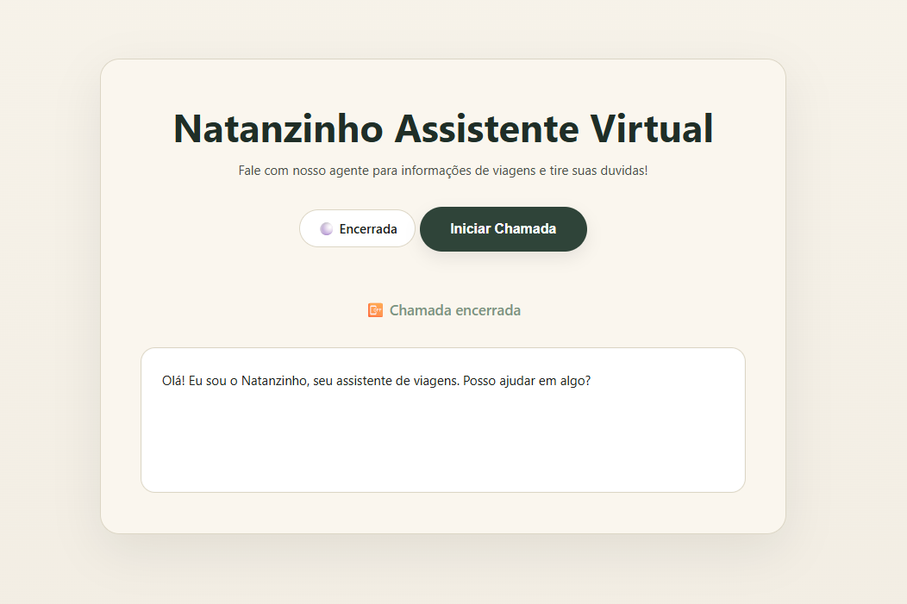
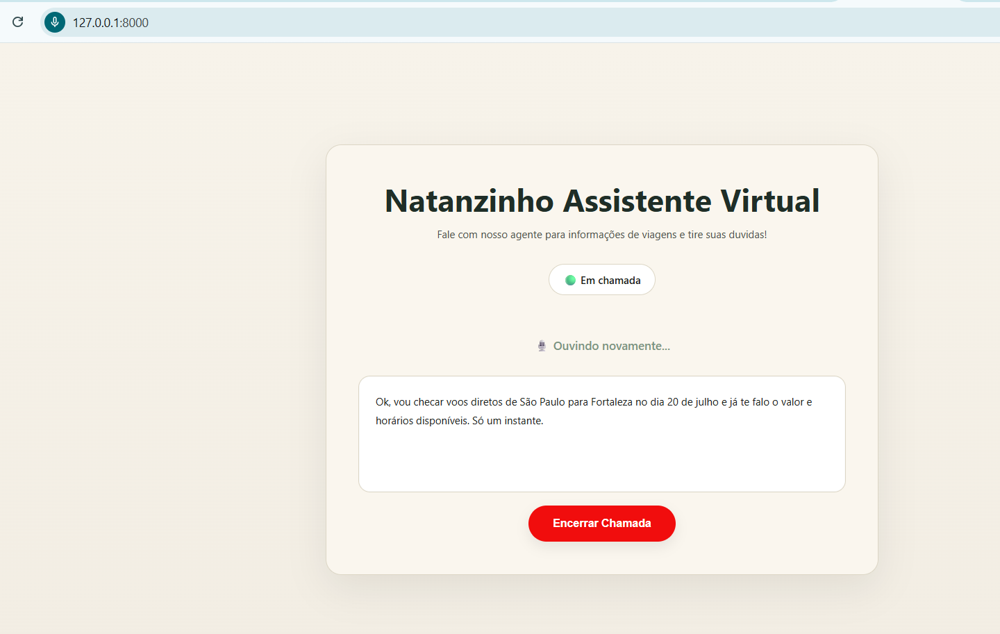
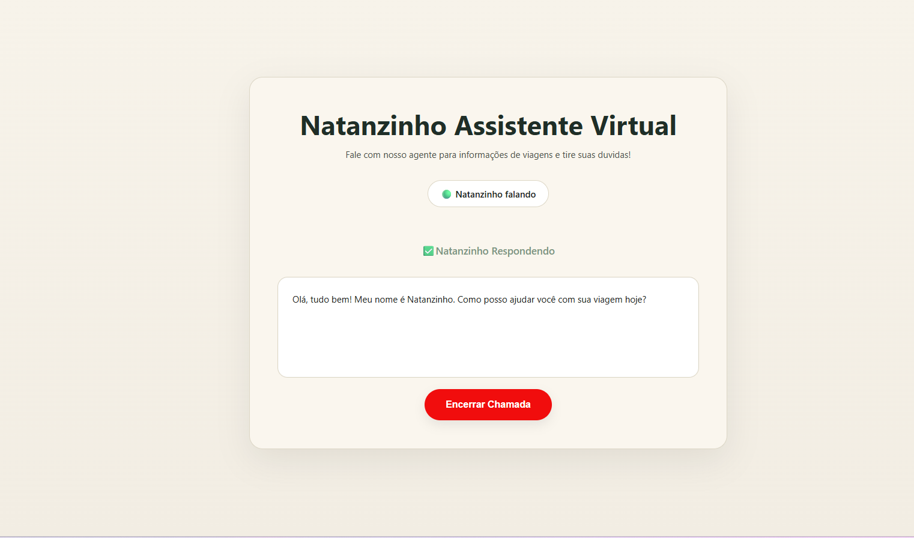

# Assistente Telefônico com IA

Sistema de atendimento por voz desenvolvido com FastAPI, JavaScript e OpenAI.

O projeto simula uma ligação telefônica em tempo real, permitindo que o usuário converse por voz com uma inteligência artificial através do navegador.

---

## Demonstração

### Tela Inicial



### Conversa em Andamento



### IA Respondendo



---

## Funcionalidades

* Reconhecimento de voz via navegador
* Conversação contínua
* Integração com OpenAI API
* Respostas em áudio (Text-to-Speech)
* Histórico de contexto da conversa
* Interface web responsiva
* Simulação de atendimento telefônico
* Encerramento de chamada em tempo real

---

## Tecnologias Utilizadas

### Backend

* Python
* FastAPI
* OpenAI API
* Uvicorn
* Python Dotenv

### Frontend

* HTML5
* CSS3
* JavaScript
* Speech Recognition API
* Speech Synthesis API

---

## Arquitetura

```text
Usuário
   ↓
Microfone
   ↓
Speech Recognition
   ↓
FastAPI
   ↓
OpenAI API
   ↓
Resposta
   ↓
Speech Synthesis
   ↓
Áudio para o usuário
```

---

## Estrutura do Projeto

```text
project-ia-call/
│
├── app/
│   ├── main.py
│   │
│   ├── routes/
|   |   └── voice.py
|   | 
│   ├── templates/
│   │    └── index.html
│   │   
│   ├── services/
│   │   └── ai_services.py
│   │
│   └── static/
│       ├── css/
│       │   └── style.css
│       │
│       └── js/
│           └── voice.js
│
├── .env
├── requirements.txt
└── README.md
```

---

## Instalação

Clone o repositório:

```bash
git clone https://github.com/seu-usuario/seu-projeto.git
```

Acesse a pasta:

```bash
cd project-ia-call
```

Crie o ambiente virtual:

```bash
python -m venv venv
```

Ative o ambiente:

Windows:

```bash
venv\Scripts\activate
```

Linux/Mac:

```bash
source venv/bin/activate
```

Instale as dependências:

```bash
pip install -r requirements.txt
```

---

## Configuração

Crie um arquivo `.env`

```env
OPEN_API_KEY=sua_chave_aqui
```

---

## Executando o Projeto

```bash
uvicorn app.main:app --reload
```

Acesse:

```text
http://127.0.0.1:8000
```

---

## Como Funciona

1. O usuário inicia uma chamada.
2. O navegador captura o áudio.
3. A fala é convertida em texto.
4. O texto é enviado ao FastAPI.
5. A OpenAI gera uma resposta.
6. A resposta é exibida na tela.
7. A resposta é convertida para áudio.
8. A IA fala com o usuário.
9. O sistema volta a escutar automaticamente.

---

## Próximas Melhorias

* Banco de dados SQLite
* Histórico de chamadas
* Dashboard administrativo
* Sistema de autenticação

---

## Objetivo do Projeto

Este projeto foi desenvolvido para demonstrar conhecimentos em:

* Desenvolvimento Backend
* APIs REST
* Inteligência Artificial
* Processamento de Voz
* Integração com APIs Externas
* Desenvolvimento Full Stack
* Engenharia de Software

